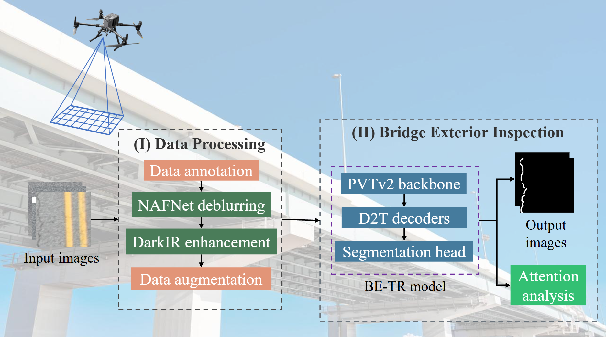
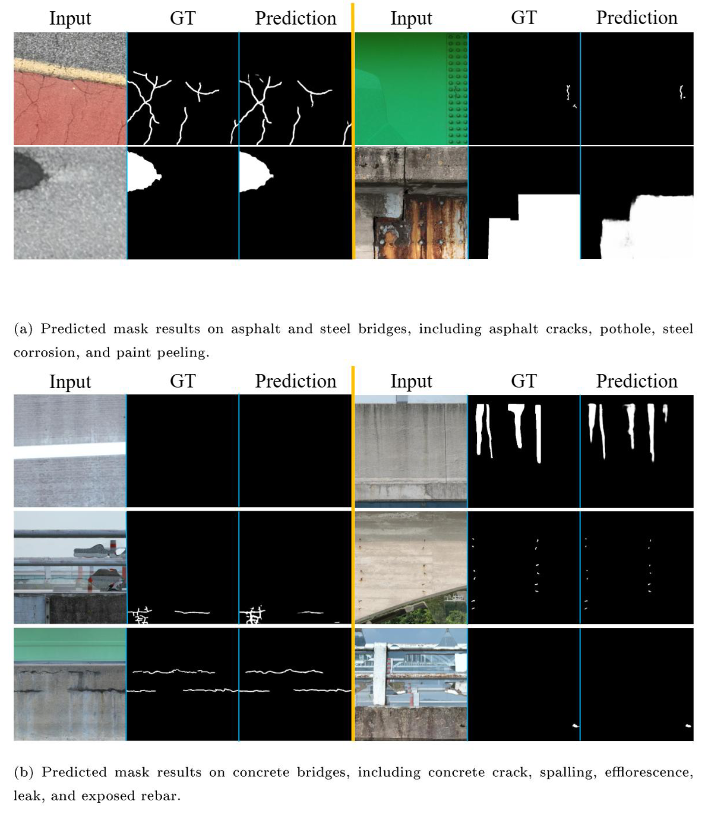
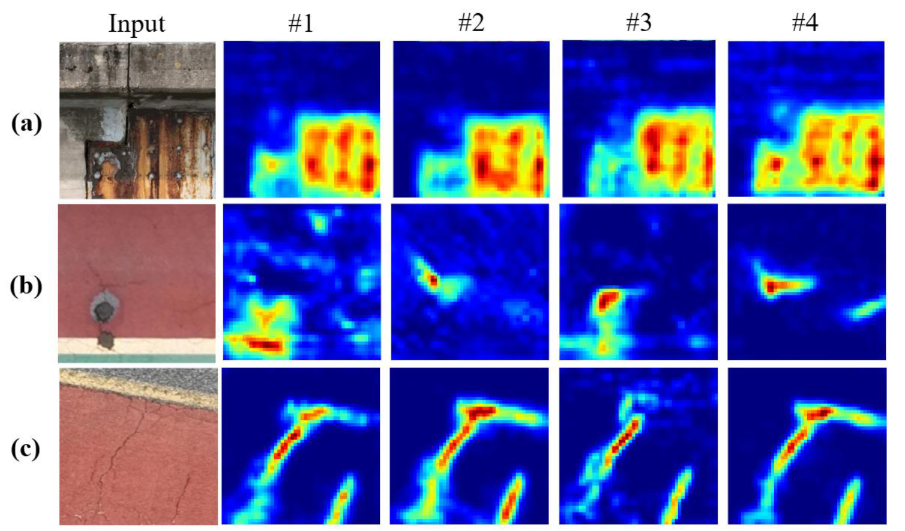
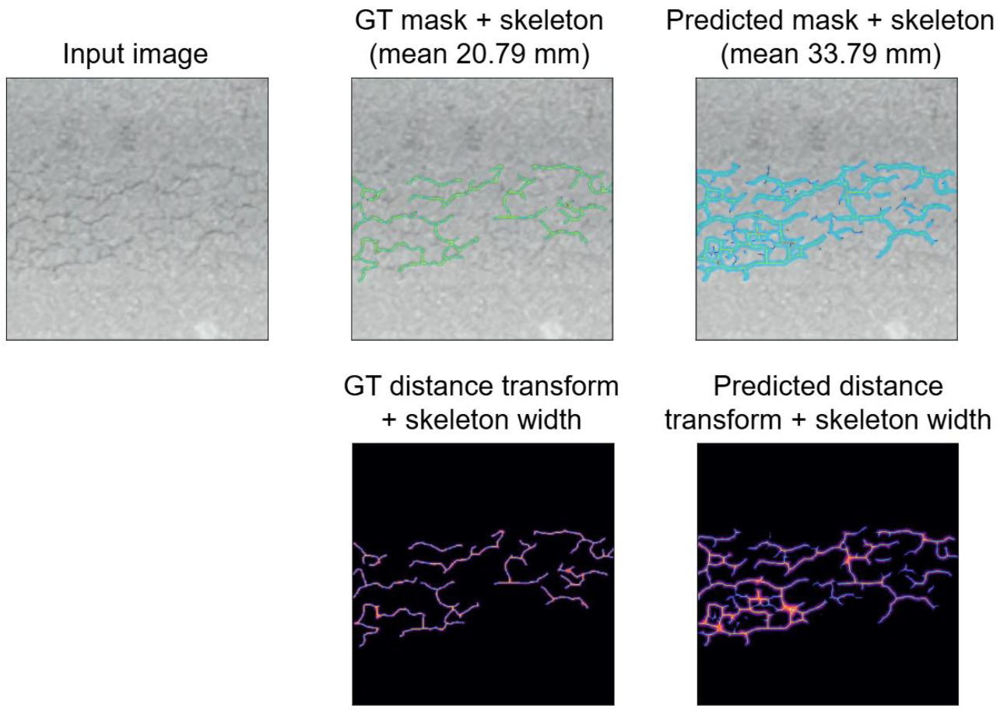

# BE-TR: Pixel-level Bridge Exterior Defect Segmentation using an Improved Query-based Transformer

This repository contains the official implementation of **BE-TR** (Bridge Exterior Transformer), a query-based Transformer framework for pixel-level segmentation of bridge exterior defects from UAV orthorectified imagery.

---

## 📌 Model Introduction

BE-TR is built upon [WPFormer](https://github.com/yan-hao-tian/WPFormer) and adapts it for bridge-specific defect segmentation through three key contributions:

- **Two-stage pre-processing pipeline** (NAFNet deblurring + DarkIR low-light enhancement) that is architecture-agnostic and consistently improves segmentation MAE by 20–30% across four structurally distinct architectures.
- **Wavelet-enhanced Cross-Attention (WCA)** — introduces dual-domain (spatial and frequency) query conditioning via Haar decomposition and a Multi-Scale Context Module (MSCM), suppressing non-defect high-frequency noise without reliance on mask priors.
- **Prototype-guided Cross-Attention (PCA)** — updates queries using soft-assigned semantic prototypes with global and local channel weighting, eliminating cascading failure risk from hard mask priors (as in Mask2Former).

The framework achieves **MAE = 0.022** on a large-scale bridge defect dataset spanning 9 defect classes and 321,681 UAV-captured images.


*Figure 1: BE-TR framework overview. Stage I applies frozen NAFNet and DarkIR sequentially to restore blurred and low-light UAV images. Stage II feeds enhanced images through a PVTv2 backbone, refined by three cascaded D2T decoder blocks (WCA + PCA + self-attention), before a segmentation head produces pixel-level defect masks.*

**Supported defect classes:** Asphalt crack · Concrete crack · Efflorescence · Leakage · Exposed rebar · Spalling · Pothole · Steel corrosion · Paint peeling

**Paper:** *A Pixel-level Defect Segmentation for Bridge Exterior using an Improved Query-based Transformer* — submitted to Developments in the Built Environment.

---

## 📂 Dataset

The training dataset comprises **321,681** high-resolution UAV orthorectified images of Korean bridge structures (concrete, steel, composite), annotated with 849,677 instance-level polygon segmentations across 9 defect classes. This is the largest publicly described bridge defect segmentation dataset to date.

**Download options:**

- 🔗 **AIHub** (Korean National AI Data Platform): [https://aihub.or.kr](https://aihub.or.kr) — search for "Bridge Exterior Defect"
- 📧 **Contact author**: If you cannot access AIHub, please contact [hmoon@sejong.ac.kr](mailto:hmoon@sejong.ac.kr) with your institutional affiliation and intended use.

**Dataset structure** (COCO format):
```
datasets/
└── BridgeDefect/
    ├── train/
    │   ├── images/
    │   └── gt/
    ├── val/
    │   ├── images/
    │   └── gt/
    └── test/
        ├── images/
        └── gt/
```

---

## 🚀 Training

### Prerequisites

```bash
git clone https://github.com/your-username/BE-TR.git
cd BE-TR
pip install -r requirements.txt
```

Required packages include PyTorch, torchvision, OpenCV, Pillow, and [sod-metrics](https://github.com/lartpang/PySODMetrics).

### Run training

```bash
python train_betr.py \
    --dataset BridgeDefect \
    --data_root datasets \
    --save_root save \
    --model_name BE-TR
```

**Key arguments:**

| Argument | Default | Description |
|---|---|---|
| `--dataset` | `ESDIs-SOD` | Dataset name (folder under `data_root`) |
| `--data_root` | `datasets` | Root directory containing dataset folders |
| `--save_root` | `save` | Directory to save model checkpoints |
| `--model_name` | `WPFormer` | Name prefix for saved checkpoint files |

The model trains for 24 epochs with the Adam optimizer (lr = 8×10⁻⁵, cosine decay). Checkpoints are saved when a new best weighted F-measure is achieved.

### Pretrained checkpoint

A pretrained BE-TR checkpoint (MAE = 0.022 on the bridge defect test set) is available for download:

📥 **[Download pretrained weights — Google Drive](drivelink)**

Place the downloaded `.pth` file in:
```
save/BridgeDefect/BE-TR-BridgeDefect-best.pth
```

---

## 🔍 Inference & Feature Visualization

`test_feature_visualization.py` runs BE-TR inference on a single image and generates a side-by-side comparison of the original F2 feature maps and prototype-activated feature maps, showing how PCA directs attention to defect regions.

### Usage

```bash
# Basic inference with feature visualization
python test_feature_visualization.py \
    --image path/to/image.jpg \
    --gt path/to/gt_mask.png \
    --model save/BridgeDefect/BE-TR-BridgeDefect-best.pth \
    --output ./results

# Without ground truth (inference only)
python test_feature_visualization.py \
    --image path/to/image.jpg \
    --model save/BridgeDefect/BE-TR-BridgeDefect-best.pth \
    --output ./results
```

**Key arguments:**

| Argument | Default | Description |
|---|---|---|
| `--image` | required | Path to input RGB image |
| `--gt` | `None` | Path to ground truth mask (optional) |
| `--model` | — | Path to model checkpoint `.pth` |
| `--output` | `./feature_visualizations` | Directory to save output images |
| `--size` | `384` | Input image size |

### Sample output

The script produces two files per image: `*_feature_maps.png` (original vs. prototype-activated feature maps) and `*_comparison.png` (input / GT / prediction).


*Figure 2: Qualitative examples of bridge defect detection generated by the BE-TR model across various bridge types are presented.*


*Figure 3: Prototype-activated feature maps at the F2 layer for (a) steel corrosion, (b) pothole, and (c) asphalt crack. Columns #1–#4 show four learned prototype activations, each emphasizing distinct defect regions while suppressing background.*


---

## 📐 Physical Crack Width Estimation

`estimate_crack_width.py` converts pixel-level segmentation masks into physical crack width measurements using the known ground sampling distance (GSD). The method skeletonizes the predicted mask and applies the Euclidean distance transform to estimate the mean crack width in millimetres.

At inference resolution (384×384), the effective GSD is **4.0 mm/pixel**, so each image tile covers a 1.54 m × 1.54 m section of bridge surface.

### Usage

**Single sample (predicted mask already saved):**
```bash
python estimate_crack_width.py \
    --image samples/sample1.jpg \
    --gt samples/sample1_gt.png \
    --pred samples/sample1_pred.png \
    --sample_name "Sample 1 (hairline)"
```

**Single sample (run BE-TR inference automatically):**
```bash
python estimate_crack_width.py \
    --image samples/sample1.jpg \
    --gt samples/sample1_gt.png \
    --model_path save/BridgeDefect/BE-TR-BridgeDefect-best.pth \
    --sample_name "Sample 1 (hairline)"
```

**Batch mode (CSV manifest):**
```bash
python estimate_crack_width.py \
    --manifest crack_width_manifest.csv \
    --output results/crack_widths.csv
```

The manifest CSV format is: `sample, image, gt [, pred]` — the `pred` column is optional if `--model_path` is provided.

**Key arguments:**

| Argument | Default | Description |
|---|---|---|
| `--gt` | required | Ground-truth crack mask |
| `--pred` | `None` | Predicted mask (if omitted, runs BE-TR inference) |
| `--model_path` | `None` | Checkpoint for on-the-fly inference |
| `--manifest` | `None` | CSV file for batch processing |
| `--output` | `None` | Output CSV path |
| `--gsd` | `4.0` | Effective GSD in mm/pixel |
| `--size` | `384` | Mask resize resolution |

### Sample output

```
Sample                  GT width (mm)  Predicted width (mm)  Error (mm)
--------------          -------------  --------------------  ----------
Sample 1 (hairline)     36.494         31.336                5.158
Sample 2 (moderate)     51.489         52.891                1.402
Sample 3 (wide)         78.229         80.584                2.355
Sample 4 (structural)   20.789         33.785                12.996
Mean error                                                    5.478
```


*Figure 4: Physical crack width estimation from GT and predicted masks. Skeletonization reduces each mask to a 1-pixel-wide centerline; the distance transform measures local crack width at each skeleton point. BE-TR detects a denser, more topologically complete fracture network than the manual GT annotation.*

---

## 📧 Contact

For questions or issues, please open an [issue](https://github.com/your-username/BE-TR/issues) or contact the corresponding author at [hmoon@sejong.ac.kr](mailto:hmoon@sejong.ac.kr).

---

## 📝 Citation

If you use this code or dataset in your research, please cite:

```bibtex
@article{dang2025betr,
  title     = {A Pixel-level Defect Segmentation for Bridge Exterior using an Improved Query-based Transformer},
  author    = {Dang, L. Minh and Lee, Gayoon and Danish, Sufyan and Fayaz, Muhammad and Nguyen, Tan N. and Lee, Kihak and Moon, Hyeonjoon},
  journal   = {Developments in the Built Environment},
  year      = {2025}
}
```

---

## 🙏 Acknowledgements

This research was supported by the Basic Science Research Program through the National Research Foundation of Korea (NRF) funded by the Ministry of Education (RS-2024-00461244). The dataset was developed under the Korean National Information Society Agency (NIA) contract. We thank SG&I System, MUHANIT, ALL FOR LAND, and GDS Consulting Group for data collection, processing, annotation, and quality control.

This codebase builds upon [WPFormer](https://github.com/yan-hao-tian/WPFormer). We thank the authors for their open-source contribution.
